# Reusing a Sony CDP-CX350 VFD & front panel with Raspberry-Pi Pico and MicroPython
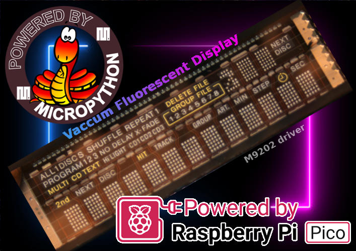

The Sony compact disk player CDP-CX350 was a 300 compact disks carrousel + compact disk player.

I did loved that device but he died after too much house move (300 CD does weight a lot). It was in 2005 (20 years before), my wonderful CD player was beyong repair

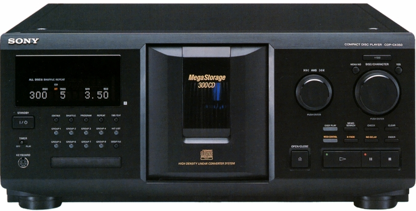

Instead of throwing that piece of technology into the trash, I did salvaged parts and carefully packed the front face.

Nowadays (Jan .2025), I do grab it back to continue my article series about the Vaccum Fluorescent Display.

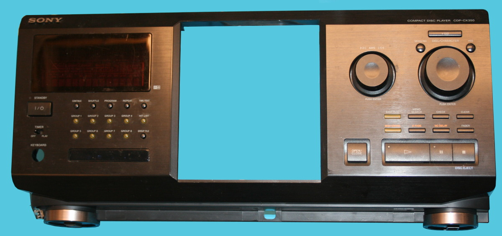

When looking the back of the PCB of the face plate:

* __Right part__: contains the __VFD display__ on the top and many buttons & LEDs at the bottom.
* __Left part__: contains two rotative button, some additional buttons & LEDs, Play, Pause, Stop buttons.

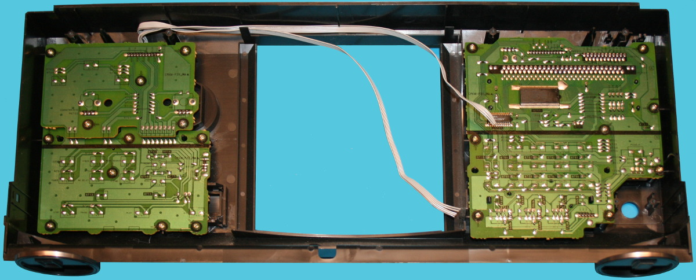

The main control board here below holds:

* __Top-left__: ribbon interface connector. this will be the main interface to control the panel.
* __Top-center__: a blue connector with wiring to the daugther board.
* __Top-right__: an IR receiver.
* __Vaccurm Fluorescent Display__ : you cannot miss the gorgeous VFD display.
* __Bottom__: contains many buttons and orange LEDs (controled with GPIO extender). The left part expose the on/off button and a RED power led.
* __Very Bottom__: the blue LEDs are IR TRANSMITTER LEDs controled through power transistor. That section have its own blue connector at the bottom of the PCB).

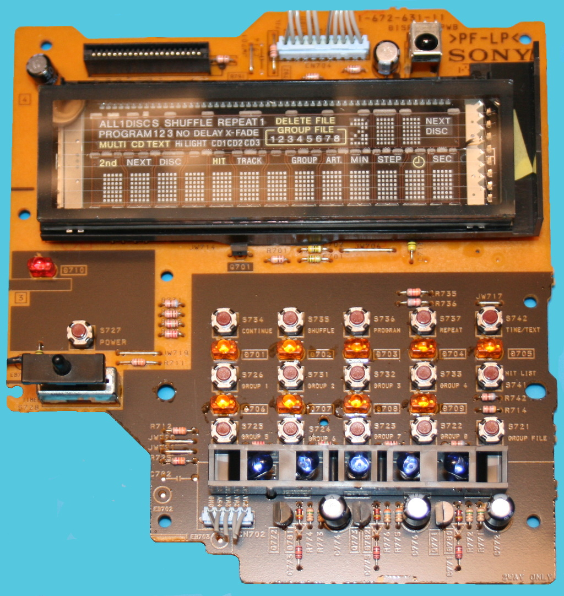

# Interfacing
In this project, I wanted to interface the VFD (Vaccum Fluorescent Display) but also all the buttons, rotary and LEDs... taking the controls of the 2 boards.

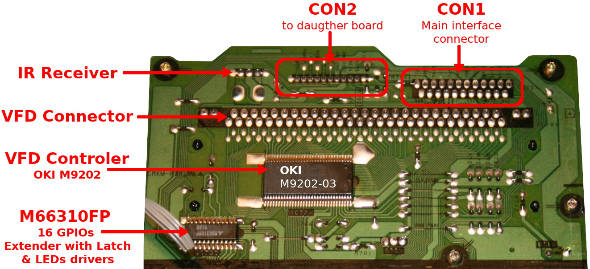

## About the Vaccum Fluorescent Display (VFD)
It is important to understand how the VFD work before starting some hacking around it.

I Recomend you the reading of the [micropython-M66004-VFD github repository](https://github.com/mchobby/micropython-M66004-VFD). It contains comprehensive informations about how a VFD works.

__Ressources:__

* [M9202 datasheet](docs/MSM9202-01.pdf) - driver of this Vaccum Fluorescent Display. Information behind "-" refer to the Character ROM used.
* __The M9202 specs looks identifcal to the [Princeton Technology PT6203 VFD controler (see this repository)](https://github.com/mchobby/micropython-PT6302-VFD)__.

## VFD interface
The [M9202 datasheet](docs/MSM9202-01.pdf) provides useful informations about control pins.

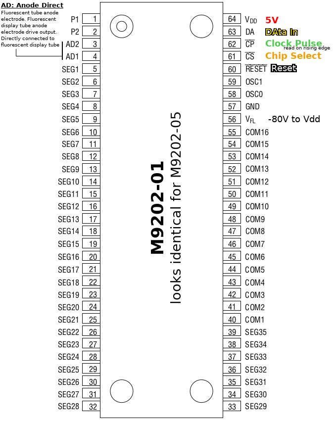

* __VDD__: Logic voltage in 5V (also work with 3.3V)
* __DA__: DataIn. Send bit by bit with lower significant bit first. 
* __CP__: Clock Pulse. Bit is read on the rising edge.
* __CS__: Chip Select. Set this low to communicates with the controler.
* __Reset__: Put it low to reset the device.
* __FVL__: Negative voltage of the VFD (down to -80 Volts!) to VDD+0.3V

The VFD controler is connected to the Main interface connector __CON1__. 

__Notice:__ many of the controls pins are shared between the VFD controler and the GPIO expander.

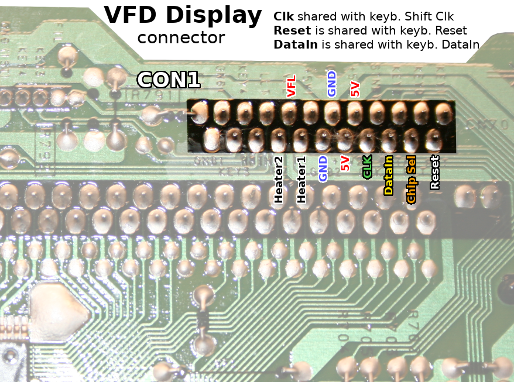

Heather Resistance is 4.80 Ω, so only a low voltage can be applied (about 2.5 to 3V). Under **2.9V, the heater draw 170mA** and provides a clear illumination of the digits. 

The usage of a **VFL voltage of -25V** is good enough to make the VFD working proprely. 

As the PCB doesn't includes the _Bias Cut-off Voltage_ circuitery, we have to make it.

Here is how to wire the Pico on the VFD display

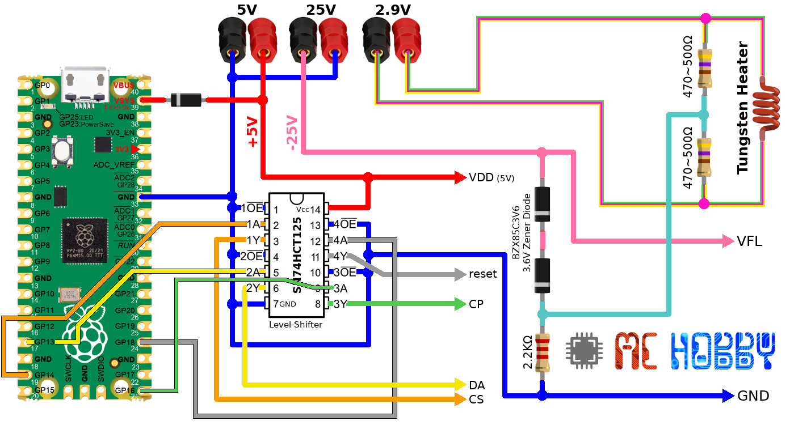

The VFD display use all the 16 digits to show characters and the symbols.

It can show 13 + 2 chars on the display. The 16th character is attached to symbols (see the [various examples](examples/)) . The setting one of the two bits of available ADRAM will setup additional symbols.

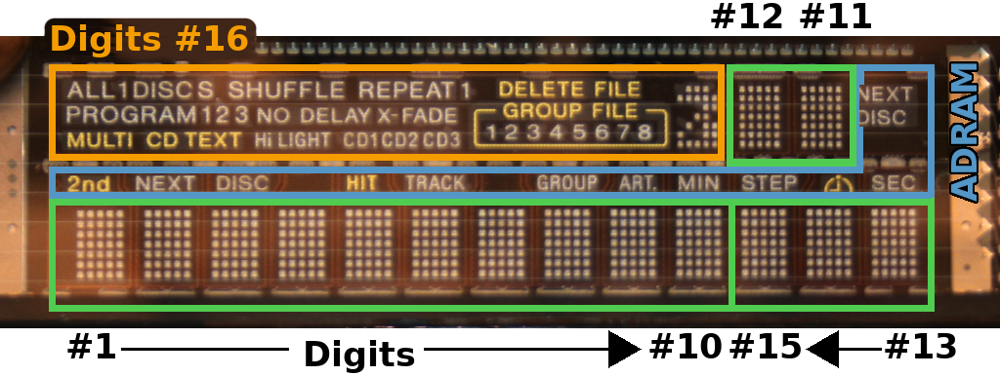

The segments on the Digit #16 controls lot of symbols on the display.

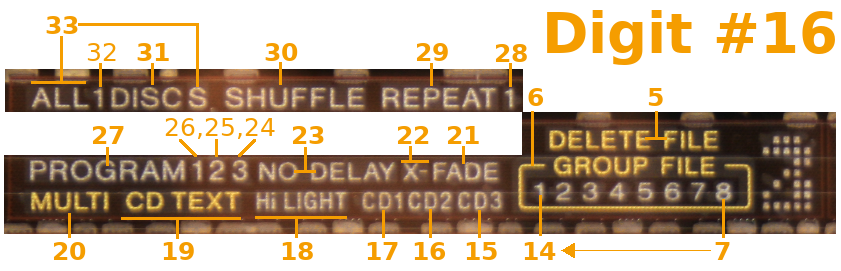

The remaining of symbols are controled with ADRAM (special RAM that add 2 bits for each Digit#).

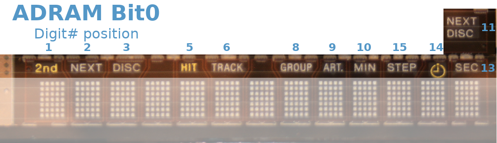

## LEDs & Buttons interface
As this project focus on the reuse of the complete panel I did also worked oo interfacing with the LEDs and buttons.

* LEDs are controled via the __M66310FP__ 16 bit GPIO Expander + LED controler
* Buttons are read through __ANALOG signals__. Several buttons share a common "key" pin with different pull-up resistor (to 5V) on each of the buttons. That result in a different analog voltage on the "key" pin depending on the pressed button.
* A distinct 5V & GND power circuit is available for the analog operations.

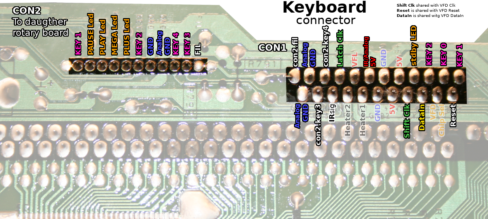

### The LEDs

The LEDs are controled with the M66310, a 16 bits GPIO Expander and LED driver (see libraries).

The GPIO expander uses a serial interface where the 16 bits is pushed one by one in a shift register. The serial interface (DataIn, Shift Clock, Reset) is shared with the VFD controler. The Latch Clk is used to send the shift register data to the GPIO Expander output.  Notice that /OE is keept LOW to keeps LEDs actives.

The picture here below indicates the name of the LEDs wired to the GPIO Expander. Names starting with "con2." are LEDs localised on the daugther board.

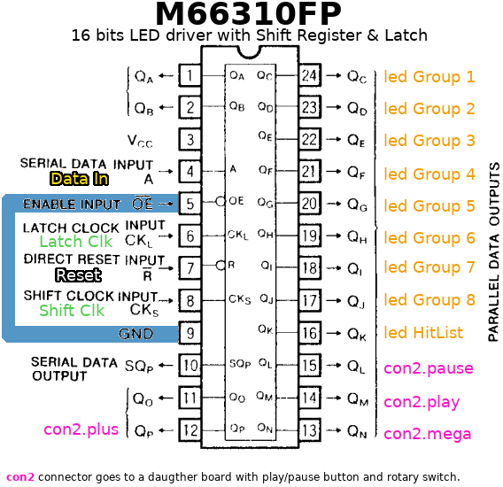

Here follow the correspondance between the bits and the LEDs. N.C. means Not Connected.

| MF66310 Bit# | Attached LED |
| -------- | ------- |
| 0 | N.C. |
| 1 | N.C. |
| 2 | Group 1 |
| 3 | Group 2 |
| 4 | Group 3 |
| 5 | Group 4 |
| 6 | Group 5 |
| 7 | Group 6 |
| 8 | Group 7 |
| 9 | Group 9 |
| 10 | Hit List |
| 11 | Pause |
| 12 | Play |
| 13 | Mega |
| 14 | Plus |
| 15 | N.C. |

### StandBy LED
The StandBy LED above the On/Off button is controled directly by the main board connector (CON1)

### The buttons 

The buttons are grouped in several analog circuits labelled Key0, Key1, Key2, Key3, Key4 (all reported on the main connector).

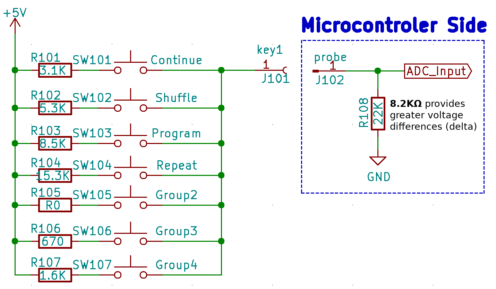

The microcontroler side must add the remaining divider bridge to read the ADC voltage. After several tests a **8.2KΩ** pull-down resistor provides the better voltage outputs.

__Rotary Encoder Remark:__

rotaty encoder do creates square signal transition on two distinct pins (so two "key" output). The pin on wich the transition appears first indicates the rotation direction (clockwise or anti-clockwise)

| KEY 0 output | Voltage (V) |
| -------- | ------- |
| no action| 0.00 |
| Timer Play | 2.20 |
| On/Off | 1.24 |
| Group 1 | 1.62 |
| Group 5 | 1.89 |
| Group 6 | 2.20 |
| Group 7 | 2.49 |
| Group 8 | 2.73 |
| Group File | 2.90 |

| KEY 1 output | Voltage (V) |
| -------- | ------- |
| no action | 0.00 |
| Disc encoder | 0.00 → 1.26 → 0.00 |
| Repeat | 1.23 |
| Program | 1.61 |
| Shuffle | 1.89 |
| Continue | 2.20 |
| Group 4 | 2.49 |
| Group 3 | 2.73 |
| Group 2 | 2.89 |

| KEY 2 output | Voltage (V) |
| -------- | ------- |
| no action | 0.81 |
| Disc encoder | 0.81 → 0.00 → 0.81 |
| PRESS AMS encoder | 1.26 |
| PRESS Disc encoder | 1.67 |
| Menu/No | 1.97 |
| +100 | 2.32 |
| Yes  | 2.66 |

| KEY 3 output | Voltage (V) |
| -------- | ------- |
| no action | 0.00 |
| AMS encoder | 0.00 → 1.23 → 0.00 |
| X-Fade| 1.26 |
| No delay | 2.20 |
| Fader | 2.73 |

| KEY 4 output | Voltage (V) |
| -------- | ------- |
| no action | 1.22 |
| AMS encoder | 1.22 → 0.00 → 1.22 |
| Open/Close | 1.62 |
| Play | 1.89 |
| Pause | 2.19 |
| Stop | 2.49 |
| Mega Control | 2.73 |
| Easy Play | 2.90 |

 

# Libraries

* `vfd_pt63.py` : the main VFD display library must be [downloaded from the micropython-PT6302-VFD github](https://github.com/mchobby/micropython-PT6302-VFD) - The Princeton PT6302 VFD driver also works for the OKI M9202.
* `m66310.py`: is a driver to control the Mitsubishi M66310 16 bits GPIO exmpander (see [M66310 datasheet](docs/M66310P.pdf) for more details)